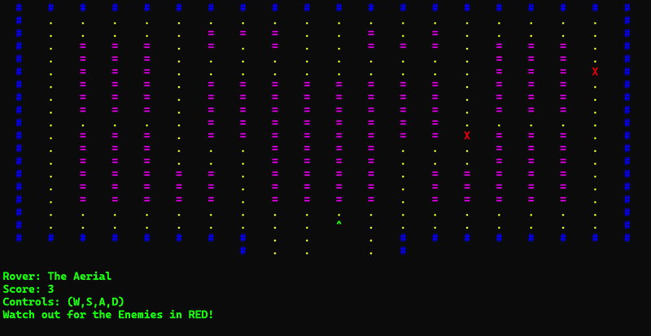

# PATHFINDER

A terminal-based 2D maze game written in C, built as a second-semester Computer Engineering project. The goal was to implement a real-time game loop, enemy AI, and flicker-free rendering from scratch — no game engine, no graphics library.



---

## Overview

You control a rover navigating a 20×20 grid. Collect all 159 data points before two enemies close in. The enemies move every turn, actively pathfinding toward you. If one reaches your position, the game ends.

**Rover types** (cosmetic only — different character sets):

| Name | Characters (forward / backward / left / right) |
|---|---|
| The Aerial | `^` `v` `<` `>` |
| The Tanker | `M` `W` `E` `3` |
| The Digger | `n` `u` `c` `o` |

**Controls:** `W` `A` `S` `D` — real-time, no Enter required.

---

## Technical Implementation

### Game Loop & Rendering

The game runs a blocking input loop using `getch()`, which captures keystrokes without waiting for Enter. On Windows this uses `<conio.h>`. On Linux, the same behavior is implemented manually using `termios` raw mode — disabling canonical input and echo, reading one character, then restoring the terminal state.

Each frame redraws the entire 20×20 grid. To avoid the screen flicker that `system("cls")` causes, the renderer uses the ANSI escape code `\033[H` to snap the cursor back to the top-left of the terminal and draw over the previous frame in place. This is the same technique used in classic terminal UIs.

Color output uses 24-bit true color ANSI sequences (`\033[1;38;2;R;G;Bm`), bypassing the standard 16-color terminal palette entirely.

### Map Representation

The game world is a `char map[20][20]` array. Every game element — walls, paths, obstacles, enemies, the rover — is stored as a character directly in this array. Movement is handled by writing the new character to the target cell and restoring the previous cell to what it held before.

Enemies each track `enemy_under[e]`, the character that was at their position before they moved onto it, so that cell can be correctly restored when the enemy moves away. Without this, any dot an enemy walks over would be permanently erased and the map becomes unsolvable.

### Enemy AI

Enemy movement is resolved once per player move. Each enemy runs a greedy Manhattan distance comparison:

```
diff_p = |player_row - enemy_row|
diff_q = |player_col - enemy_col|
```

If the row distance is greater, the enemy attempts to close the row gap first. Otherwise, it closes the column gap. If the preferred axis is blocked by a wall or obstacle, it falls back to the secondary axis. If both are blocked, the enemy holds position.

This produces enemies that navigate around the map's internal structure without requiring a full pathfinding graph — appropriate for the map's layout, where corridors typically leave one axis free.

### Enemy Spawning

Enemies spawn at random positions validated against the following conditions:

- Not a wall (`#`), obstacle (`=`), or blank space
- Not already occupied by another enemy
- Not the player's starting position

Spawn is retried until a valid cell is found.

---

## Build & Run

The game compiles on both Windows and Linux. Platform differences are handled at compile time using preprocessor directives — `<conio.h>` on Windows, `termios` raw mode on Linux.

### Linux (GCC)
```bash
git clone https://github.com/k256505/pathfinder.git
cd pathfinder
gcc robo_navigator.c -o pathfinder
./pathfinder
```

### Windows (GCC / MinGW)
```bash
git clone https://github.com/k256505/pathfinder.git
cd pathfinder
gcc robo_navigator.c -o pathfinder.exe
pathfinder.exe
```

### Cross-compile Windows binary from Linux
```bash
x86_64-w64-mingw32-gcc robo_navigator.c -o pathfinder.exe
```

---

## Known Limitations

- **Greedy pathfinding.** The Manhattan distance heuristic can get enemies stuck in specific map configurations where both axes are blocked simultaneously. A BFS or A* implementation would solve this but was outside the scope of the project.
- **Single-file architecture.** All logic — map, rendering, input, AI — lives in one file. Splitting into modules (map, render, entity) would make the codebase easier to extend.
- **Fixed map.** The grid is hardcoded. A file-loaded map system would allow multiple levels and add replayability.

---

## License

MIT — see [LICENSE](LICENSE).
